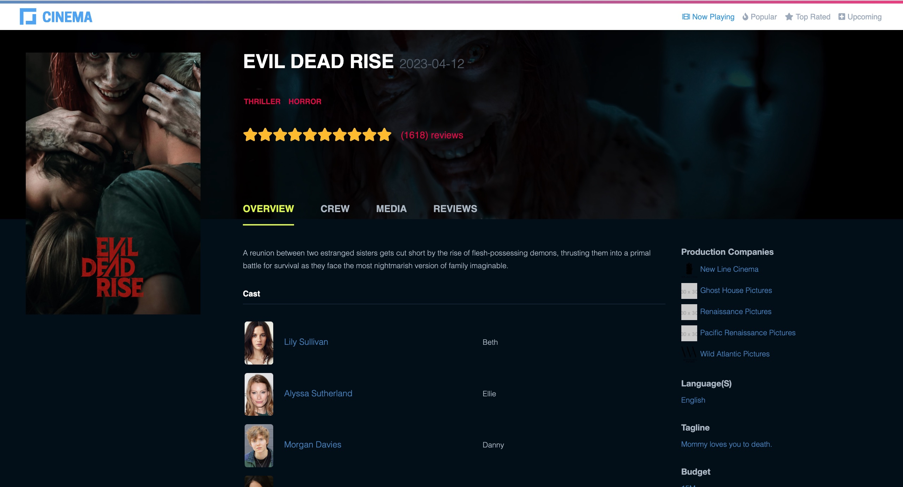
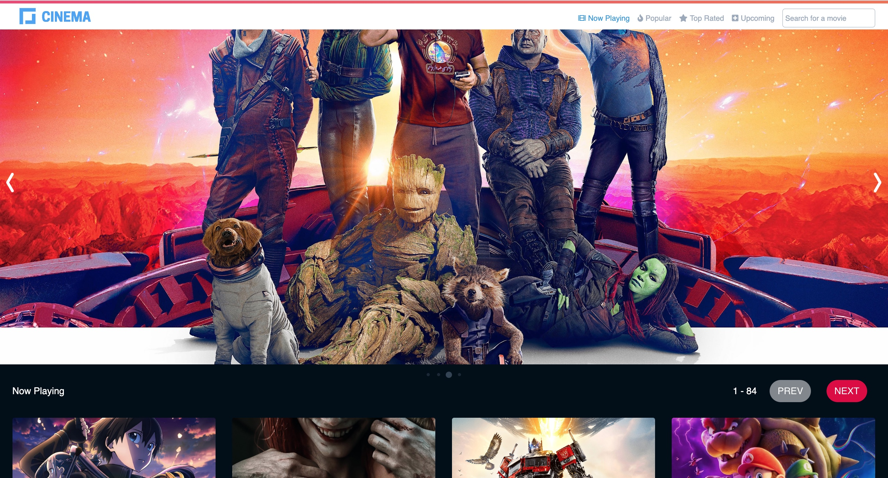

# Cinema-App

This is just a Frontend project that utilizes The Movie Database Api to view and search movies
A react app built with redux and deployed to AWS S3 and distributed with AWS cloudfront.
This project is really just an exploration of devops practices, where I: 

* Setup Continuous Integration/Delivery Pipeline with Circle Ci
* Created AWS Services using Terraform
* Integrated Terraform into CircleCI Pipeline
* Used AWS S3 and CloudFront for Storing and Distributing the app
* Created Docker Images for the Cinema app
* Integrated Slack in the CI/CD Pipeline
* Setup Online Dev, Staging and Production Environments in Github for automatic deployments




## Table of Contents

- [Project Name](#project-name)
  - [Table of Contents](#table-of-contents)
  - [Technology Used](#technology-used)
  - [Usage](#usage)
    -[Run](#run)

## Technology Used

* React
* Redux
* AWS S3 and CloudFront
* Terraform
* Slack
* Docker
* Github
* Sentry for Monitoring
* CircleCI for CI/CD

## Usage

cd into the cinema-app directory

Run npm install or yarn install

Create an account on https://www.themoviedb.org/ and obtain an API key.

Create a .env file in the root of the project and add
``REACT_APP_API_SECRET=your api key``

### Run

```
npm start
```
